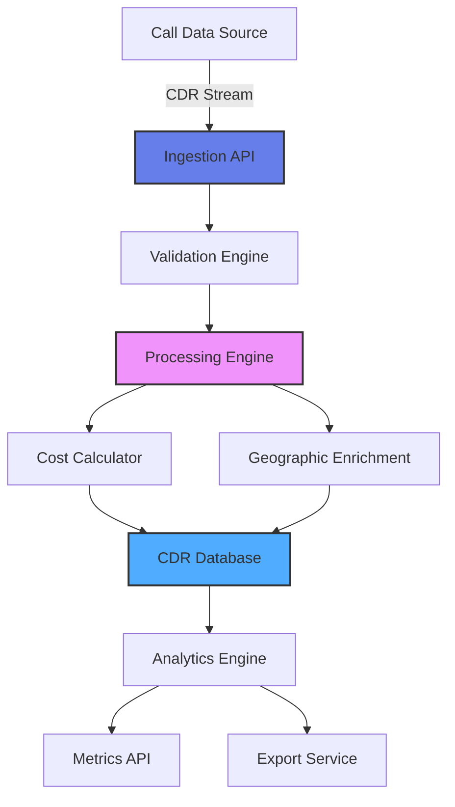

# 📞 Real-Time CDR Processing Pipeline

[](https://www.python.org/)
[](https://fastapi.tiangolo.com/)
[](LICENSE)

A production-grade Call Detail Record (CDR) processing pipeline for telecom systems. Ingests, validates, processes, and analyzes call data in real-time - similar to systems used by telecom providers like Amazon Connect, Twilio, and carrier networks.

## 🎯 Project Overview

This system demonstrates data engineering and real-time processing capabilities essential for telecom operations. It processes call detail records (CDRs) at scale, calculates billing information, detects anomalies, and provides analytics - core functionality for any VoIP or contact center platform.

**Industry Applications:**
- Telecom billing systems
- Contact center analytics
- VoIP platform operations
- Fraud detection
- Network performance monitoring

## ✨ Features

### Data Ingestion
- **Real-Time Processing**: Stream-based CDR ingestion
- **Batch Import**: Bulk upload historical CDRs
- **Data Validation**: Schema validation and data quality checks
- **Duplicate Detection**: Prevent duplicate CDR processing

### Data Processing
- **Cost Calculation**: Automatic call cost computation based on rates
- **Duration Analysis**: Parse and calculate call durations
- **Geographic Enrichment**: Country/region identification
- **Carrier Routing**: Track which carrier handled each call
- **Time Zone Handling**: Proper timestamp management

### Analytics Engine
- **Real-Time Metrics**: Live call statistics
- **Cost Analytics**: Revenue and cost tracking
- **Traffic Analysis**: Call volume patterns
- **Carrier Performance**: Per-carrier statistics
- **Geographic Distribution**: Calls by region/country
- **Time-Based Aggregations**: Hourly, daily, monthly rollups

### Data Management
- **Time-Series Storage**: Efficient CDR storage with indexing
- **Query API**: RESTful endpoints for data access
- **Export Capabilities**: CSV/JSON export for billing
- **Data Retention**: Configurable retention policies

## 🏗️ Architecture


## 🛠️ Tech Stack

- Framework: FastAPI (high-performance async)
- Database: SQLite (production: PostgreSQL/TimescaleDB)
- Data Processing: Pandas
- Validation: Pydantic models
- API Documentation: OpenAPI/Swagger

## 📦 Installation
### Prerequisites

- Python 3.8 or higher
- pip

## Setup

1. Clone the repository
```
git clone https://github.com/yourusername/cdr-processing-pipeline.git
cd cdr-processing-pipeline

```

2. Install dependencies
```
pip install -r requirements.txt
```

3. Run the server
```
python app.py
```

4. Access the API


- API:``` http://localhost:8000```
- Interactive docs:``` http://localhost:8000/docs```
- Alternative docs:``` http://localhost:8000/redoc```

## 🚀 Usage
### Submit a Single CDR

```
curl -X POST "http://localhost:8000/cdr" \
  -H "Content-Type: application/json" \
  -d '{
    "call_id": "call_12345",
    "caller_number": "+14155551234",
    "called_number": "+442071234567",
    "start_time": "2025-01-05T10:30:00Z",
    "end_time": "2025-01-05T10:35:30Z",
    "duration_seconds": 330,
    "carrier_id": "carrier_001",
    "call_type": "international",
    "country_code": "GB"
  }'
```

### Batch Import CDRs

```
curl -X POST "http://localhost:8000/cdr/batch" \
  -H "Content-Type: application/json" \
  -d '[
    {"call_id": "call_001", "caller_number": "+1234567890", ...},
    {"call_id": "call_002", "caller_number": "+9876543210", ...}
  ]'
```

### Get Analytics
```
# Overall statistics
curl "http://localhost:8000/analytics/summary"

# Cost analysis
curl "http://localhost:8000/analytics/costs"

# Traffic analysis
curl "http://localhost:8000/analytics/traffic?period=daily"

# Carrier performance
curl "http://localhost:8000/analytics/carriers"

# Geographic distribution
curl "http://localhost:8000/analytics/geographic"
```

### Query CDRs
```
# Get recent CDRs
curl "http://localhost:8000/cdr?limit=100"

# Filter by date range
curl "http://localhost:8000/cdr?start_date=2025-01-01&end_date=2025-01-31"

# Filter by carrier
curl "http://localhost:8000/cdr?carrier_id=carrier_001"

# Filter by country
curl "http://localhost:8000/cdr?country_code=US"
```

### Export Data
```
# Export as JSON
curl "http://localhost:8000/export?format=json" -o cdrs.json

# Export as CSV for billing
curl "http://localhost:8000/export?format=csv&start_date=2025-01-01" -o billing_jan2025.csv
```

## 📊 API Endpoints
### CDR Operations

| Method | Endpoint | Description |
|--------|----------|-------------|
| POST | `/cdr` | Submit single CDR |
| POST | `/cdr/batch` | Batch import CDRs |
| GET | `/cdr` | Query CDRs with filters |
| GET | `/cdr/{call_id}` | Get specific CDR |
| DELETE | `/cdr/{call_id}` | Delete a CDR |

### Analytics

| Method | Endpoint | Description |
|--------|----------|-------------|
| GET | `/analytics/summary` | Overall statistics |
| GET | `/analytics/costs` | Cost and revenue analysis |
| GET | `/analytics/traffic` | Call volume patterns |
| GET | `/analytics/carriers` | Per-carrier statistics |
| GET | `/analytics/geographic` | Geographic distribution |

### Data Export

| Method | Endpoint | Description |
|--------|----------|-------------|
| GET | `/export` | Export CDRs (JSON/CSV) |
| POST | `/import` | Import from CSV file |

### System

| Method | Endpoint | Description |
|--------|----------|-------------|
| GET | `/health` | Health check |
| GET | `/stats` | System statistics |

## 📋 Example Responses
### POST /cdr
```
{
  "id": 1,
  "call_id": "call_12345",
  "caller_number": "+14155551234",
  "called_number": "+442071234567",
  "start_time": "2025-01-05T10:30:00Z",
  "end_time": "2025-01-05T10:35:30Z",
  "duration_seconds": 330,
  "carrier_id": "carrier_001",
  "call_type": "international",
  "country_code": "GB",
  "cost": 0.99,
  "revenue": 1.49,
  "profit_margin": 0.50,
  "timestamp": "2025-01-05T10:35:31Z"
}
```

### GET /analytics/summary
```
{
  "total_calls": 15847,
  "total_duration_seconds": 2847593,
  "total_duration_hours": 790.99,
  "average_call_duration": 179.7,
  "total_cost": 4523.89,
  "total_revenue": 6785.34,
  "total_profit": 2261.45,
  "call_types": {
    "local": 8234,
    "national": 4567,
    "international": 3046
  },
  "time_period": "all_time"
}
```

### GET /analytics/carriers
```
{
  "total_carriers": 5,
  "carrier_stats": [
    {
      "carrier_id": "carrier_001",
      "total_calls": 6234,
      "total_duration": 1123456,
      "total_cost": 1876.54,
      "average_cost_per_minute": 0.015,
      "success_rate": 98.7
    },
    {
      "carrier_id": "carrier_002",
      "total_calls": 4523,
      "total_duration": 812345,
      "total_cost": 1234.67,
      "average_cost_per_minute": 0.012,
      "success_rate": 97.2
    }
  ]
}
```

### GET /analytics/geographic
```
{
  "total_countries": 45,
  "top_countries": [
    {
      "country_code": "US",
      "country_name": "United States",
      "call_count": 8234,
      "total_duration": 1456789,
      "percentage": 52.0
    },
    {
      "country_code": "GB",
      "country_name": "United Kingdom",
      "call_count": 3456,
      "total_duration": 623456,
      "percentage": 21.8
    }
  ]
}
```

### 📁 Project Structure
```
cdr-processing-pipeline/
├── app.py                    # Main FastAPI application
├── cdr_processor.py          # CDR processing engine
├── cost_calculator.py        # Cost calculation logic
├── requirements.txt          # Python dependencies
├── test_pipeline.py          # Test script with sample data
├── rate_tables.json          # Carrier rate configurations
├── cdrs.db                   # SQLite database (auto-created)
├── README.md                 # This file
└── LICENSE                   # MIT License
```

## 🎓 Skills Demonstrated
### Data Engineering
- ✅ Data Pipeline Design: End-to-end data flow
- ✅ Stream Processing: Real-time CDR ingestion
- ✅ Data Validation: Schema validation and quality checks
- ✅ ETL Operations: Extract, Transform, Load
- ✅ Time-Series Data: Efficient temporal data handling
### Backend Development
- ✅ RESTful API: Production-grade endpoints
- ✅ Async Programming: High-throughput processing
- ✅ Database Design: Optimized schema with indexes
- ✅ Error Handling: Robust exception management
### Telecom Domain
- ✅ CDR Processing: Industry-standard call records
- ✅ Billing Logic: Cost calculation and revenue tracking
- ✅ Carrier Management: Multi-carrier operations
- ✅ Geographic Routing: International call handling
### Analytics
- ✅ Aggregations: Statistical calculations
- ✅ Time-Series Analysis: Trend detection
- ✅ Business Metrics: KPI tracking
- ✅ Data Export: Reporting capabilities


## 🔍 Technical Highlights
### CDR Data Model
```
class CDR(BaseModel):
    call_id: str
    caller_number: str
    called_number: str
    start_time: datetime
    end_time: datetime
    duration_seconds: int
    carrier_id: str
    call_type: str  # local, national, international
    country_code: str
```
### Cost Calculation Engine
```
def calculate_cost(duration, call_type, country, carrier):
    """
    Calculate call cost based on:
    - Call duration (seconds)
    - Call type (local/national/international)
    - Destination country
    - Carrier rates
    
    Returns: cost, revenue, profit_margin
    """
```
### Real-Time Aggregations
```
def aggregate_metrics(time_period):
    """
    Real-time aggregations:
    - Calls per minute/hour/day
    - Revenue by time period
    - Traffic patterns
    - Carrier distribution
    """
```

## 🧪 Testing
### Quick Start Test
```
# Start the server
python app.py

# In another terminal, run tests
python test_pipeline.py
```

## Manual Testing

1. Open browser:``` http://localhost:8000/docs```
2. Try the "POST /cdr" endpoint
3. Submit sample call data
4. Check analytics endpoints
5. Export data to CSV


## Sample Test Data
```
# Submit test CDR
curl -X POST "http://localhost:8000/cdr" \
  -H "Content-Type: application/json" \
  -d '{
    "call_id":"test_001",
    "caller_number":"+14155551234",
    "called_number":"+442071234567",
    "start_time":"2025-01-05T10:00:00Z",
    "end_time":"2025-01-05T10:05:00Z",
    "duration_seconds":300,
    "carrier_id":"carrier_001",
    "call_type":"international",
    "country_code":"GB"
  }'

# Check if it was processed
curl "http://localhost:8000/cdr?call_id=test_001"

# View analytics
curl "http://localhost:8000/analytics/summary"
```
## 📈 Use Cases
1. Telecom Billing Systems
Process CDRs for accurate billing and invoicing.
2. Contact Center Analytics
Analyze call patterns and agent performance.
3. Fraud Detection
Identify unusual call patterns and suspicious activity.
4. Carrier Cost Optimization
Compare carrier costs and optimize routing.
5. Network Performance Monitoring
Track call quality and success rates.
6. Business Intelligence
Generate reports on call volumes, revenue, and trends.

## 🚀 Future Enhancements
- Real-time streaming with Kafka/Redis Streams
- PostgreSQL/TimescaleDB for production scale
- Machine learning for fraud detection
- Real-time dashboard with WebSocket
- Advanced rate plan management
- Call quality metrics (MOS scores)
- Integration with billing systems
- Multi-tenant support
- Data partitioning for large volumes
- Automated alerting for anomalies

## 📝 License
- MIT License - see LICENSE file
## 👤 Author
Sanik Patige

-GitHub: @sanikpatige
